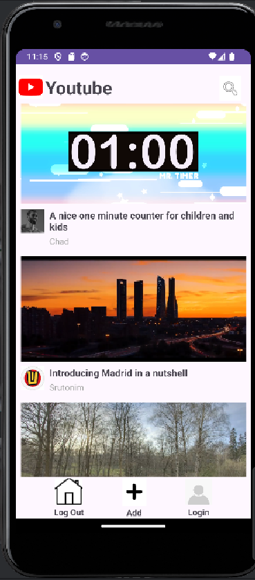
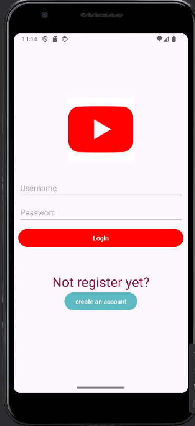
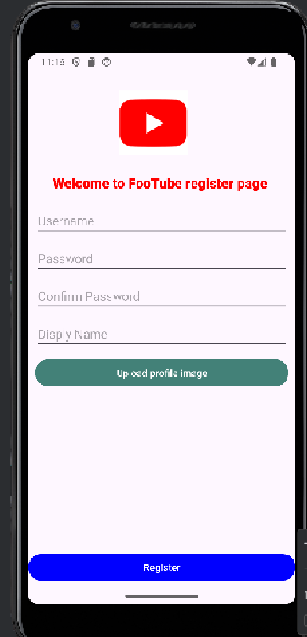
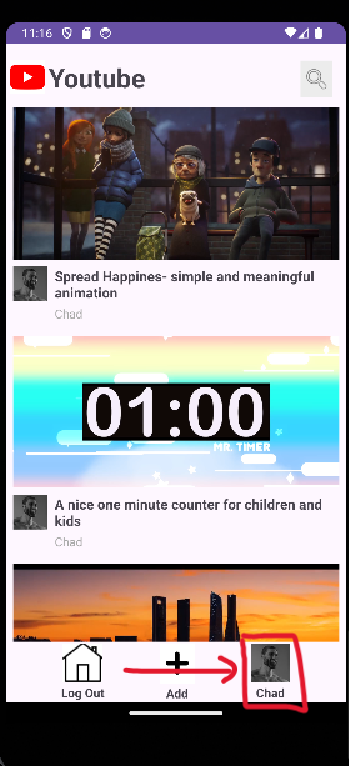
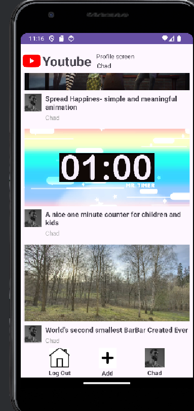
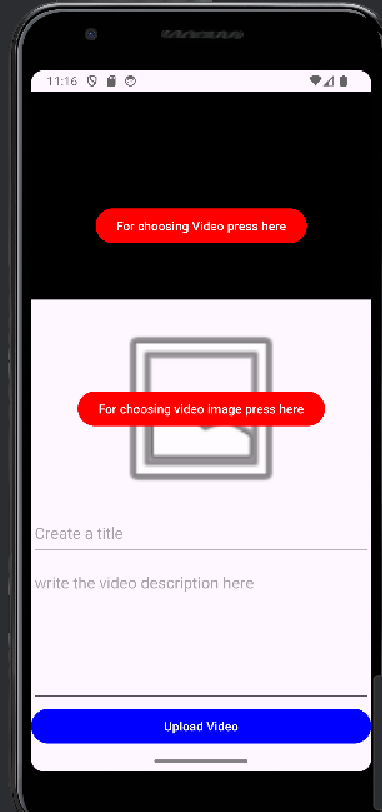
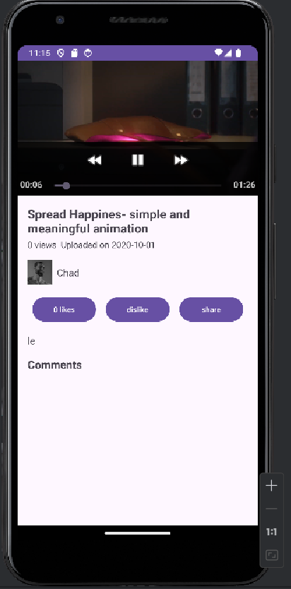

San Haviv.

This is part 3 Readme, previous Part 2 readme is in the relevant branch.

Make sure you have MongoDB installed and it is running in the background.
requests to server will be run on port:12345

first run the server by navigating into "server side" directory and running "npm start" from terminal

secondly, open Android Studio and run an emulator or on your Android phone the 

the Homepage screen:
will display videos and entering those videos will navigate you to watching them on the watching page, 
and there's a login button which will navigate you to the login screens.
if you are logged in it will display your name and profile picture on the top right corner 
and if you press on your profile picture icon you will be navigated to UserProfile page,
also there will be a "add new video" where it will navigate you to uploading a new video to the youtube page.

the Login screen:
will display a friendly interface that will have you entering your registered username and password. 
if correct you will be logged in and navigated back to Homepage, 
if you are not registered there is a "register" button that will take you to the register screen
where you can create your first account.

the Register screen:
easy and simple register form with profile picture , username, password and display name.

the UserProfile screen:
Once you have logged in to your account you may press on your Icon on the bottom right and it will display your display name and it will also show all of the videos you have updated where you can watch them or delete them if you would like.

the AddNewVideo screen:
simple form navigating you to upload a video on to youtube.

the Watching screen:
where you can watch the video you have chosen to see and also see the comments of this video, while other videos are being recommanded to you. 

